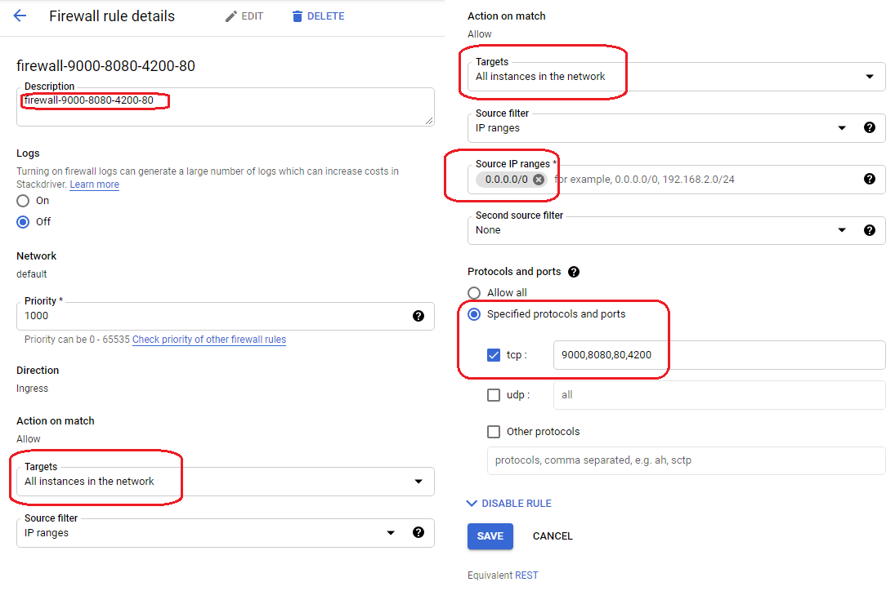

## Setup the GCP VM with the script

### Run the REST Service 

##### Dockerfile

```
FROM openjdk:8-jdk-alpine
VOLUME /tmp
ARG DEPENDENCY=target/dependency
COPY ${DEPENDENCY}/BOOT-INF/lib /app/lib
COPY ${DEPENDENCY}/META-INF /app/META-INF
COPY ${DEPENDENCY}/BOOT-INF/classes /app
ENTRYPOINT ["java","-cp","app:app/lib/*","com.spring.boot.fullstack.webservices.restfulwebservices.RestfulWebServicesApplication"]
```

#### Following are the curl commands to authenticate and then to invoke with the token

curl -i -X POST    -H "Content-Type:application/json"    -d '{
>   "username": "lalit",
>   "password": "dummy"
> }'  'http://localhost:9000/authenticate'

curl -i -X GET    -H "Authorization:Bearer <token here>"  'http://localhost:9000/jpa/users/lalit/todos'

#### To get the curl commands use the Talend API extension


#### Open the firewall port from GCP



#### React Frontend

$ npm install

$ npm start

##### Production Build 

$ npm run build

